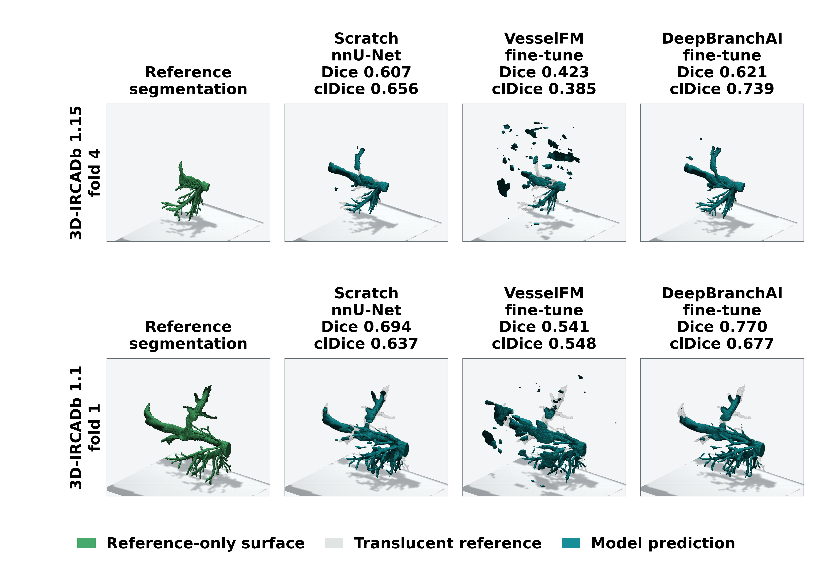

# DeepBranchAI

**A transferable 3D segmentation model for branching networks**

[](https://github.com/alexmaltsev/DeepBranchAI/actions/workflows/ci.yml)
[](https://zenodo.org/records/19363534)
[](LICENSE)

DeepBranchAI is a released 3D nnU-Net checkpoint trained on expert-refined skeletal-muscle mitochondrial focused ion beam scanning electron microscopy (FIB-SEM) labels. It is intended as a pretrained initialization for fine-tuning on 3D branching-network segmentation tasks, where small voxel errors can disconnect branches or create false connections.

The paper, **DeepBranchAI: A Transferable 3D Segmentation Model for Branching Networks**, by Alexander V. Maltsev, Lisa M. Hartnell, and Luigi Ferrucci, has been accepted in *Frontiers in Artificial Intelligence*. Final article metadata and the publisher DOI will be added after publication.

## Accepted-Paper Results

- Source-domain five-fold validation: Dice `0.942 +/- 0.020` and clDice `0.940 +/- 0.021` across 20 full 128-slice mitochondrial FIB-SEM volumes.
- DeepBranchAI-pretrained fine-tuning had higher mean clDice than scratch nnU-Net on 3D-IRCADb venous CT, Plant CT roots, and AeroPath airway CT.
- Relative differences in mean clDice were `11.7%`, `5.5%`, and `1.9%`, respectively.
- Mean absolute connected-component error was `25.0%` lower for Plant CT roots and `11.7%` lower for AeroPath.
- On 3D-IRCADb, mean Dice and clDice were `0.679` and `0.629` for DeepBranchAI-pretrained fine-tuning, compared with `0.464` and `0.360` for VesselFM fine-tuning.

The complete accepted tables, fold dispersion, paired-volume statistics, and result provenance are under [`results/`](results/README.md). Claims above are descriptive unless supported by the paired Wilcoxon/Holm-adjusted results in Table 6.



Figure 5 compares a successful held-out 3D-IRCADb case (top) and a challenging case (bottom). Each row shows the reference mask and predictions from scratch nnU-Net, VesselFM fine-tuning, and DeepBranchAI-pretrained fine-tuning. Source masks and case metrics are included under [`results/qualitative/figure5/`](results/qualitative/figure5/README.md).

## Released Checkpoints

All five mitochondrial cross-validation checkpoints, the nnU-Net plans, and the dataset configuration are archived on [Zenodo record 19363534](https://zenodo.org/records/19363534).

| Fold | Checkpoint |
|---:|---|
| 0 | [DeepBranchAI_MitoEye_fold0.pth](https://zenodo.org/records/19363534/files/DeepBranchAI_MitoEye_fold0.pth?download=1) |
| 1 | [DeepBranchAI_MitoEye_fold1.pth](https://zenodo.org/records/19363534/files/DeepBranchAI_MitoEye_fold1.pth?download=1) |
| 2 | [DeepBranchAI_MitoEye_fold2.pth](https://zenodo.org/records/19363534/files/DeepBranchAI_MitoEye_fold2.pth?download=1) |
| 3 | [DeepBranchAI_MitoEye_fold3.pth](https://zenodo.org/records/19363534/files/DeepBranchAI_MitoEye_fold3.pth?download=1) |
| 4 | [DeepBranchAI_MitoEye_fold4.pth](https://zenodo.org/records/19363534/files/DeepBranchAI_MitoEye_fold4.pth?download=1) |

Fold 0 is the default single-checkpoint initialization because it was used for the accepted paper's external fine-tuning experiments. See [`MODEL_CARD.md`](MODEL_CARD.md) for architecture, training, intended-use, and evaluation details.

## Installation

The tested paper environment used Python 3.12, PyTorch 2.2.1 with CUDA 11.8, and nnU-Net v2.3.1.

```bash
git clone https://github.com/alexmaltsev/DeepBranchAI.git
cd DeepBranchAI

# Install a CUDA build of PyTorch appropriate for your system first.
python -m pip install torch==2.2.1 torchvision==0.17.1 --index-url https://download.pytorch.org/whl/cu118
python -m pip install -e ".[nnunet,notebooks]"
```

Windows and Linux conda setup scripts remain available as `install.bat` and `install.sh`.

## Download A Checkpoint

```python
from deepbranchai.downloads import download_and_install_pretrained_weights
from deepbranchai.paths import setup_environment

paths = setup_environment(storage_dir="/path/to/deepbranchai-assets")
checkpoint = download_and_install_pretrained_weights(paths, fold=0)
print(checkpoint)
```

Use `fold=0`, `1`, `2`, `3`, or `4`. The helper installs the selected weight and its nnU-Net configuration under the configured `nnUNet_results`, `nnUNet_preprocessed`, and `nnUNet_raw` roots.

## Fine-Tune On A Branching-Network Dataset

Start with [`demo/Demo_Finetune.ipynb`](demo/Demo_Finetune.ipynb) and [`docs/Finetune_Custom_Data.md`](docs/Finetune_Custom_Data.md). The helper accepts paired 3D raw images and binary reference masks in TIFF, NIfTI, MHA, or MHD format, checks the split and volume shapes, converts the data to nnU-Net layout, and fine-tunes the released checkpoint.

The accepted experiments were fine-tuning studies, not zero-shot evaluation. New domains should provide paired image/reference-label data and should be assessed with overlap and continuity-sensitive metrics.

## Repository Map

| Path | Contents |
|---|---|
| [`deepbranchai/`](deepbranchai/) | Reusable download, data-preparation, fine-tuning, inference, and metric helpers |
| [`demo/`](demo/) | Destriping, custom fine-tuning, and VESSEL12 notebooks |
| [`train/`](train/) | Source training and validation notebooks plus external-transfer protocol code |
| [`results/`](results/README.md) | Accepted tables, per-volume metrics, statistics, and qualitative source masks |
| [`docs/`](docs/) | Fine-tuning, storage, model, transfer, and reproducibility documentation |
| [`scripts/`](scripts/) | Publication-result validation and statistical analysis scripts |
| [`tests/`](tests/) | Unit tests for data handling, metrics, downloads, and workflow checks |

## Reproduce The Reported Statistics

```bash
python scripts/compute_external_transfer_statistics.py
python scripts/validate_publication_results.py
```

The first command recomputes the paired Wilcoxon signed-rank tests and Holm correction from the included out-of-fold per-volume measurements. The second verifies the accepted manuscript tables against their machine-readable CSV files. See [`docs/Reproducibility.md`](docs/Reproducibility.md).

## VESSEL12 Resources

The VESSEL12 notebook, checkpoint, and training package provide a lung-vasculature demonstration and fine-tuning example. These resources are available alongside the external-evaluation results for 3D-IRCADb, Plant CT roots, and AeroPath.

## Citation

Citation metadata is provided in [`CITATION.cff`](CITATION.cff). Until the final publisher DOI is assigned, cite the accepted article as:

> Maltsev AV, Hartnell LM, Ferrucci L. DeepBranchAI: A Transferable 3D Segmentation Model for Branching Networks. *Frontiers in Artificial Intelligence*. Accepted, 2026.

Model artifacts are available from [Zenodo record 19363534](https://zenodo.org/records/19363534). The earlier preprint record is available at [doi:10.64898/2026.03.25.714249](https://doi.org/10.64898/2026.03.25.714249).

## License And Funding

Code and repository materials are released under the [CC0 1.0 Universal dedication](LICENSE). Third-party datasets and comparator models retain their original licenses.

This work was supported by the Intramural Research Program of the National Institutes of Health. The findings and conclusions are those of the authors and do not necessarily represent the views of the NIH or the U.S. Department of Health and Human Services.
